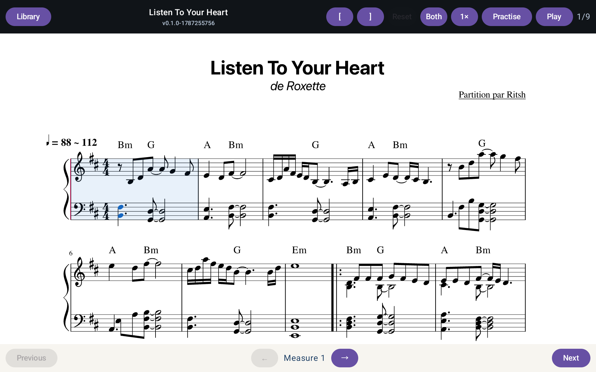
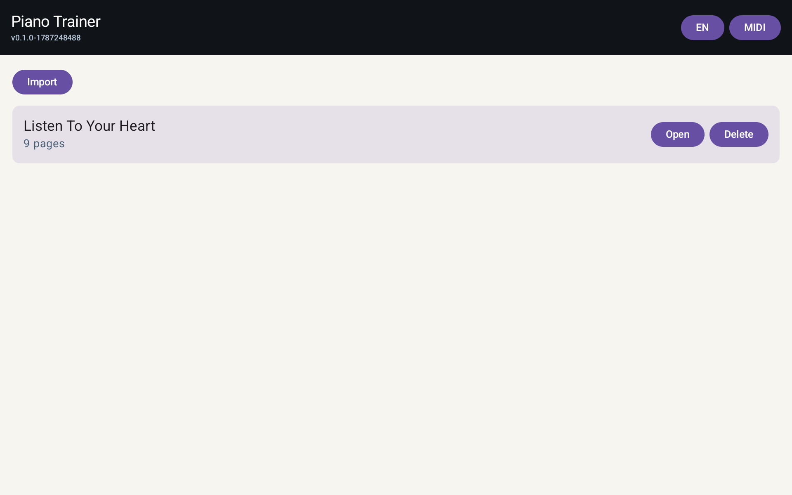
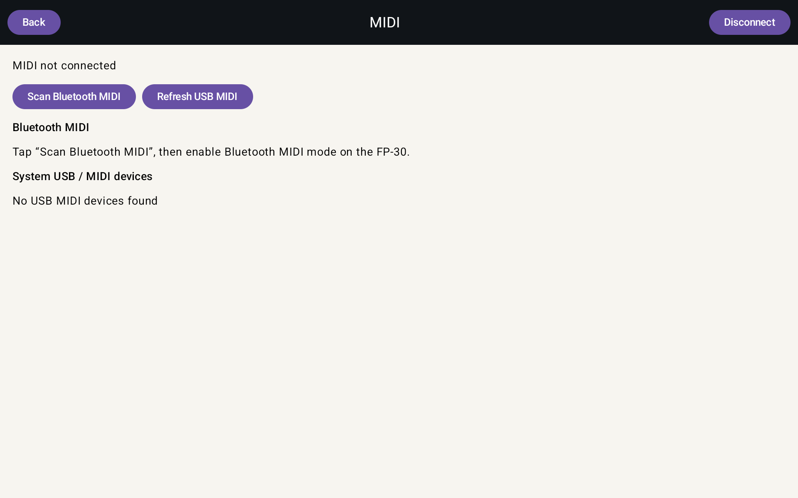

# Piano Trainer

**Русская версия: [README.ru.md](README.ru.md)**

Piano Trainer is a local Android practice app for a digital piano. It turns a score prepared in MuseScore into an interactive exercise: follow the notation, play it on a MIDI keyboard, practise one or both hands, or listen to playback.

The project is designed for a Samsung SM-X230 tablet and a Roland FP-30, but uses standard Android MIDI APIs and can work with other compatible devices.

## What it does

- Imports verified `.pianoscore` packages into a local library.
- Displays the original MuseScore engraving as scalable SVG pages.
- Connects to USB MIDI and Bluetooth LE MIDI keyboards.
- Plays the learning MIDI through the connected instrument.
- Waits for the right notes in **Practise** mode and marks mistakes.
- Supports left hand, right hand, or both hands; speed control; and a selected range of measures.

## Screens

All product UI is available in English by default (Russian can be selected inside the app).



*Score screen: choose hands and speed, then use **Practise** or **Play**. Move the cursor
with **←** and **→**, and mark a range of measures with **[** and **]**.*



*The English library on a Samsung SM-X230: import a prepared package or open MIDI settings.*



*MIDI settings: scan for Bluetooth MIDI or refresh USB MIDI devices.*

## Quick start

### 1. Install the Android app

1. Open [`android-app`](android-app) in Android Studio.
2. Install Android SDK Platform 37 and Build Tools 36.0.0.
3. Build a debug APK:

   ```sh
   cd android-app
   ./gradlew :app:assembleDebug
   ```

4. Install `app/build/outputs/apk/debug/app-debug.apk` on an Android 12+ tablet. You may use Android Studio or ADB:

   ```sh
   adb install -r app/build/outputs/apk/debug/app-debug.apk
   ```

The app uses landscape orientation and opens in full-screen mode.

### 2. Download a score from MuseScore.com

Only download scores that you created yourself, are in the public domain, or that you are licensed/allowed to use. Respect the licence shown on the score page and MuseScore’s download conditions. A download button may require a MuseScore subscription; do not use third-party downloaders or bypass access controls.

1. At [MuseScore.com](https://musescore.com/), find a **Solo Piano** score with both treble and bass staves.
2. Open the score and inspect its **License** and instrumentation in **Score info**.
3. Select **Download** and, where available, choose the **MuseScore** source file (`.mscz`). Save it to a folder on your Mac, for example `~/Downloads`.
4. Open the `.mscz` in MuseScore Studio. Check that it contains exactly one piano part with two playable hands; simplify or correct the notation if necessary, then save it.

This project deliberately requires `.mscz`. PDF is only a picture and MIDI does not reliably retain readable engraving, so neither is a supported input to the new conversion workflow.

### 3. Convert the score

Install [MuseScore Studio 4](https://musescore.org/en/download) and make its `mscore` command available in `PATH`. You also need Python 3.10+.

From the repository root:

```sh
mscore --version
python3 --version

python3 score-preparer/src/prepare_mscz.py \
  /absolute/path/to/your-score.mscz \
  --output local-content/your-score.pianoscore

python3 score-preparer/src/audit_score_package.py \
  local-content/your-score.pianoscore --strict
```

The converter exports MuseScore SVG and MusicXML, builds a clean two-hand MIDI timeline, links notes to their visual positions, and records SHA-256 checksums. It stops with an error rather than creating a package when it cannot safely identify both piano hands or map the notes to the engraving.

### 4. Load and practise

Choose one of the following ways to load the package.

**In the app**

1. Copy `your-score.pianoscore` to the tablet (for example, to **Downloads**).
2. Open Piano Trainer and select **Import score**.
3. Choose the package in Android’s file picker, then select **Open** in the library.

**Directly from a development Mac**

With one USB-debugging-enabled tablet connected:

```sh
python3 score-preparer/src/install_pianoscore.py \
  local-content/your-score.pianoscore
```

Use `--serial <adb-serial>` if more than one device is connected. The installer validates the package, copies it to the app’s private library, and restarts Piano Trainer.

Then select **MIDI** to connect the piano via USB, or allow Nearby devices and use **Scan Bluetooth MIDI**. Open a score, choose a hand and a speed, and:

- select **Practise** — the cursor waits until you play the expected note or chord;
- select **Play** — the score plays through the connected MIDI device while the cursor advances;
- practise or play a smaller range of measures: move the cursor with **←** and **→** at the
  bottom of the screen, press **[** on the measure that starts the range, move on to the
  measure that ends it and press **]**. Pressing both on the same measure selects that single
  measure, and **Reset** clears the range. Practise and Play both loop over the selection.

## Do the same with an agent

An agent is useful for the local preparation steps; it is not part of the Android app. Give it a locally saved, legitimately obtained `.mscz` file and a connected tablet. Do not ask it to evade MuseScore download restrictions or copyright.

Example prompt:

> In the Piano Trainer repository, prepare `/absolute/path/to/my-score.mscz` for the app. Check that `mscore` and Python are available, convert it to `local-content/my-score.pianoscore`, run the strict audit, and report any issue that needs me to fix in MuseScore. If exactly one authorised ADB tablet is connected, install the verified package. Do not download scores, use third-party downloaders, or bypass licence and subscription requirements.

The agent should stop for your decision if the score’s rights are unclear, a source file is unavailable, a MuseScore edit is needed, or it needs permission to access a connected device.

## Repository layout

- [`android-app`](android-app) — Android app.
- [`score-preparer`](score-preparer) — macOS command-line score preparation tool.
- [`pianoscore-schema`](pianoscore-schema) — schema v3 contract for `.pianoscore`.
- [`sample`](sample) — small MusicXML sample.
- [`docs`](docs) — architecture, roadmap, and implementation notes.

## Further documentation

- [Score preparation details](score-preparer/README.md)
- [`.pianoscore` schema](pianoscore-schema/README.md)
- [Architecture](docs/architecture.md)
- [MVP status and limitations](docs/current-status.md)

## Limitations

- The app imports `.pianoscore`, not arbitrary `.mid`, `.pdf`, or `.musicxml` files.
- A new package needs one two-staff piano part and learning events for both hands.
- MIDI playback is sent to the connected instrument; there is no built-in software synthesizer.
- The project is currently intended for local USB/ADB installation, not Google Play distribution.

## Licence

Piano Trainer is licensed under the [GNU General Public License v3.0](LICENSE). The English text in `LICENSE` is the legally authoritative licence text. A Russian-language explanation is provided in [LICENSE.ru.md](LICENSE.ru.md); it is for convenience only and does not replace the English GPLv3 text.
